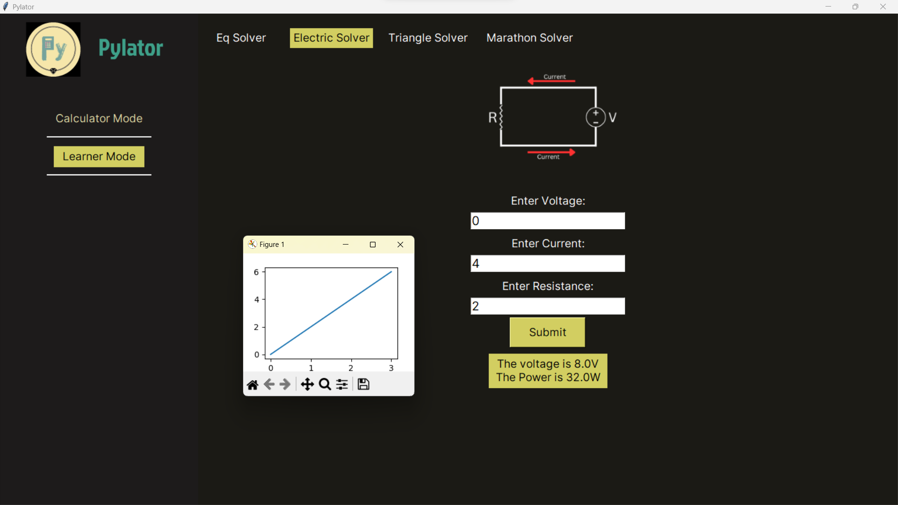

# Pylator

Pylator is a advanced GUI Physics Problem Solver written in python.

It uses `tkinter` for the GUI, `sympy` to solve equations, `matplotlib/numpy` to plot graphs, and `math` for some additional functions

It aims to provide a sleek ui/ux while being as practical as possible.

---
### Screenshot

---
### Features
- Quadratic Equation solver
- Body Mass Index calculator
- 2 variable simultaneous equation solver
- Electric Circuit solver (computes V,I,R,P and V/I graph)
- Sides of Triangle solver
- Marathon problem solver (Angle of depression)

---

### Contribution
- Fork this repo
- Clone from your terminal
- Install these libraries from pip - tkinter, sympy, numpy, matplotlib, tkhtmlview
- Make your changes
- Push with a proper commit name
- Make a Pull Request
